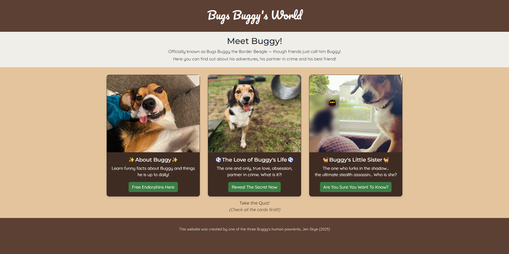
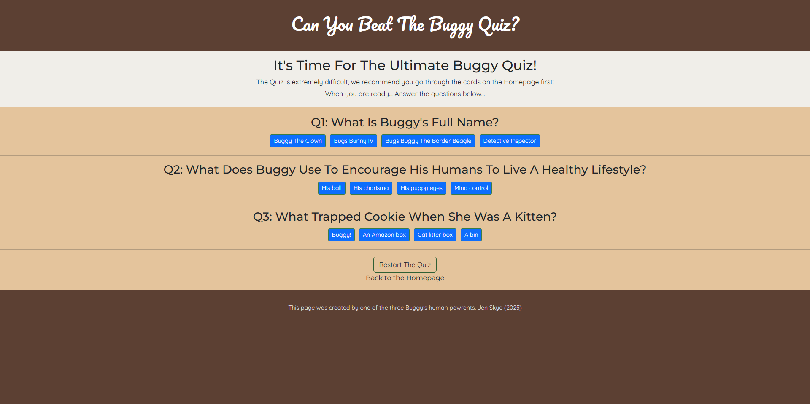

# 🐶 Bugs Buggy's World

A multipage website dedicated to the one and only **Bugs Buggy the Border Beagle** — showcasing his adventures, obsessions, and mischievous antics!

Built for **CS50x Week 8 (Homepage Project)**.  
Includes:
- HTML, CSS (responsive, mobile-friendly 📱)
- A Bootstrap-styled homepage and quiz
- A custom JavaScript quiz about Buggy’s life
- Cards, hover effects, fade-in animations, and mobile tweaks!

## 🌍 Live Website

[👉 View the deployed site here!](https://skyejen.github.io/bugs_buggys_world/)

## 📂 Structure
- `index.html` – Homepage (cards leading to other pages)
- `about.html`, `life_love.html`, `sister.html` – Extra pages
- `quiz.html` – Interactive Quiz
- `css/` – Stylesheets (main, subpages, quiz)
- `js/` – JavaScript logic for the quiz

## 🚀 Technologies
- HTML5
- CSS3
- Bootstrap 5
- Vanilla JavaScript
- Git & GitHub Pages for hosting

## 📸 Screenshots
### Homepage

### Quiz Page

## 🛠️ Future Improvements
- Add smoother animations
- Create a results page for the quiz

---

**Created with love and way too much coffee ☕ by Jen Skye (2025).**
